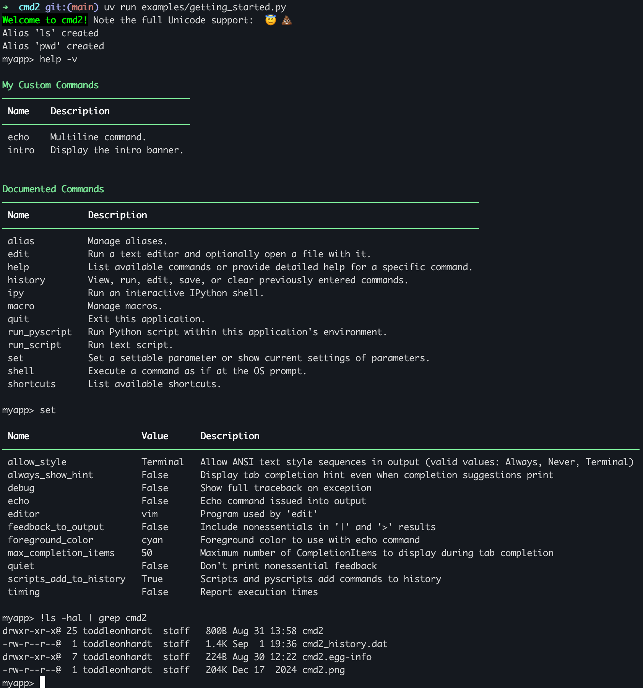

cmd2: a tool for building interactive command line apps
=======================================================
[](https://pypi.python.org/pypi/cmd2/)
[](https://travis-ci.org/python-cmd2/cmd2)
[](https://ci.appveyor.com/project/FedericoCeratto/cmd2)
[](https://python-cmd2.visualstudio.com/cmd2/_build/latest?definitionId=1&branch=master)
[](https://codecov.io/gh/python-cmd2/cmd2)
[](http://cmd2.readthedocs.io/en/latest/?badge=latest)
<a href="https://discord.gg/RpVG6tk"></a>

cmd2 is a tool for building interactive command line applications in Python. Its goal is to make it
quick and easy for developers to build feature-rich and user-friendly interactive command line
applications.  It provides a simple API which is an extension of Python's built-in
[cmd](https://docs.python.org/3/library/cmd.html) module.  cmd2 provides a wealth of features on top
of cmd to make your life easier and eliminates much of the boilerplate code which would be necessary
when using cmd.

Click on image below to watch a short video demonstrating the capabilities of cmd2:
[](https://youtu.be/DDU_JH6cFsA)

Main Features
-------------
- Searchable command history (`history` command and `<Ctrl>+r`) - optionally persistent
- Text file scripting of your application with `run_script` (`@`) and `_relative_run_script` (`@@`)
- Python scripting of your application with ``run_pyscript``
- Run shell commands with ``!``
- Pipe command output to shell commands with `|`
- Redirect command output to file with `>`, `>>`
- Bare `>`, `>>` with no filename send output to paste buffer (clipboard)
- `py` enters interactive Python console (opt-in `ipy` for IPython console)
- Option to display long output using a pager with ``cmd2.Cmd.ppaged()``
- Multi-line commands
- Special-character command shortcuts (beyond cmd's `?` and `!`)
- Command aliasing similar to bash `alias` command
- Macros, which are similar to aliases, but they can contain argument placeholders
- Ability to run commands at startup from an initialization script
- Settable environment parameters
- Parsing commands with arguments using `argparse`, including support for subcommands
- Unicode character support
- Good tab completion of commands, subcommands, file system paths, and shell commands
- Automatic tab completion of `argparse` flags when using one of the `cmd2` `argparse` decorators
- Support for Python 3.5+ on Windows, macOS, and Linux
- Trivial to provide built-in help for all commands
- Built-in regression testing framework for your applications (transcript-based testing)
- Transcripts for use with built-in regression can be automatically generated from `history -t` or `run_script -t`
- Alerts that seamlessly print while user enters text at prompt
- Colored and stylized output using `ansi.style()`

Python 2.7 support is EOL
-------------------------
The last version of cmd2 to support Python 2.7 is [0.8.9](https://pypi.org/project/cmd2/0.8.9/), released on August 21, 2018.

Supporting Python 2 was an increasing burden on our limited resources.  Switching to support only Python 3 is allowing
us to clean up the codebase, remove some cruft, and focus on developing new features.

Installation
------------
On all operating systems, the latest stable version of `cmd2` can be installed using pip:

```bash
pip install -U cmd2
```

cmd2 works with Python 3.5+ on Windows, macOS, and Linux. It is pure Python code with few 3rd-party dependencies.

For information on other installation options, see
[Installation Instructions](https://cmd2.readthedocs.io/en/latest/overview/installation.html) in the cmd2
documentation.


Documentation
-------------
The latest documentation for cmd2 can be read online here: https://cmd2.readthedocs.io/en/latest/

It is available in HTML, PDF, and ePub formats.


Feature Overview
----------------
Instructions for implementing each feature follow.

- Extension of the `cmd` module.  So capabilities provided by `cmd` still exist
    - Your applicaiton inherits from `cmd2.Cmd`, let's say you call this class `MyApp`
    ```Python
    import cmd2
    class MyApp(cmd2.Cmd):
      pass
    ```
    - Define a command named **foo** by creating a method named **do_foo**
    ```Python
    class MyApp(cmd2.Cmd):
        def do_foo(self, args):
            """This docstring is the built-in help for the foo command."""
            self.poutput(cmd2.style('foo bar baz', fg=cmd2.fg.red))
    ```
    - By default the docstring for your **do_foo** method is the help for the **foo** command
        - NOTE: This doesn't apply if you use one of the `argparse` decorators mentioned below
    - Can provide more custom help by creating a **help_foo** method (except when using `argparse` decorators)
    - Can provide custom tab completion for the **foo** command by creating a **complete_foo** method
    - Easy to upgrade an existing `cmd` app to `cmd2`
    - Run your `cmd2` app using the built-in REPL by executing the **cmdloop** method

- Searchable command history
    - Readline history using `<Ctrl>+r`, arrow keys, and other [Readline Shortcut keys](http://readline.kablamo.org/emacs.html)
    - `cmd2` `history` command provides flexible and powerful search
        - If you wish to exclude some of your custom commands from the history, append their names to the list at `Cmd.exclude_from_history`.
        - Do `help history` in any `cmd2` application for more information
    - Both of the above types of history can be optionally persistent between application runs
        - Via optional `persistent_history_file` argument to `cmd2.Cmd` initializer

- Simple scripting using text files with one command + arguments per line
    - See the [Command Scripts](https://cmd2.readthedocs.io/en/latest/features/scripting.html#command-scripts) section of the `cmd2` docs for more info
    - See [script.txt](https://github.com/python-cmd2/cmd2/blob/master/examples/scripts/script.txt) for a trivial example script that can be
    used in any `cmd2` application with the `run_script` command (or `@` shortcut)

- Powerful and flexible built-in Python scripting of your application using the `run_pyscript` command
    - Run arbitrary Python scripts within your `cmd2` application with the ability to also call custom `cmd2` commands
    - No separate API for your end users to learn
        - Syntax for calling `cmd2` commands in a `run_pyscript` is essentially identical to what they would enter on the command line
    - See the [Python Scripts](https://cmd2.readthedocs.io/en/latest/features/scripting.html#python-scripts) section of the `cmd2` docs for more info
    - Also see the [python_scripting.py](https://github.com/python-cmd2/cmd2/blob/master/examples/python_scripting.py) 
    example in conjunction with the [conditional.py](https://github.com/python-cmd2/cmd2/blob/master/examples/scripts/conditional.py) script

- Parsing commands with `argparse`
    - Two decorators provide built-in capability for using `argparse.ArgumentParser` to parse command arguments
        - `cmd2.with_argparser` - all arguments are parsed by the `ArgumentParser`
        - `cmd2.with_argparser_and_unknown_args` - any arguments not parsed by the `ArgumentParser` get passed as a list

    ```Python
    import argparse
    from cmd2 import with_argparser

    argparser = argparse.ArgumentParser()
    argparser.add_argument('-p', '--piglatin', action='store_true', help='atinLay')
    argparser.add_argument('-s', '--shout', action='store_true', help='N00B EMULATION MODE')
    argparser.add_argument('words', nargs='+', help='words to say')

    @with_argparser(argparser)
    def do_speak(self, args):
        """Repeats what you tell me to."""
        words = []
        for word in args.words:
            if args.piglatin:
                word = '%s%say' % (word[1:], word[0])
            if args.shout:
                word = word.upper()
            words.append(word)
        self.stdout.write('{}\n'.format(' '.join(words)))
    ```

    See [Argument Processing](https://cmd2.readthedocs.io/en/latest/features/argument_processing.html) in the docs for more details
    
    NOTE: `cmd2` also provides the `Cmd2ArgumentParser` customization of `argparse.ArgumentParser` for prettier formatting
    of help and error messages.

- `cmd2` applications function like a full-featured shell in many ways (and are cross-platform)
    - Run arbitrary shell commands by preceding them with `!` or `shell`
    - Redirect the output of any command to a file with `>` for overwrite or `>>` for append
        - If no file name provided after the `>`/`>>`, then output goes to the clipboard/pastebuffer
    - Pipe the output of any command to an arbitrary shell command with `|`
    - Create your own custom command aliases using the `alias` command
    - Create your own custom macros using the `macro` command (similar to aliases, but allow arguments)
    - Settable environment parameters that users can change during execution supported via `set` command
    - Option to display long output using a pager with ``cmd2.Cmd.ppaged()``
    - Optionally specify a startup script that end users can use to customize their environment

- Top-notch tab completion capabilities which are easy to use but very powerful
    - For a command **foo** implement a **complete_foo** method to provide custom tab completion for that command
        - But the helper methods within `cmd2` discussed below mean you would rarely have to implement this from scratch
    - Commands which use one of the `argparse` decorators have automatic tab completion of `argparse` flags
        - And also provide help hints for values associated with these flags
        - Experiment with the [argprint.py](https://github.com/python-cmd2/cmd2/blob/master/examples/arg_print.py) example
        using the **oprint** and **pprint** commands to get a feel for how this works
    - `path_complete` helper method provides flexible tab completion of file system paths
        - See the [paged_output.py](https://github.com/python-cmd2/cmd2/blob/master/examples/paged_output.py) example for a simple use case
        - See the [python_scripting.py](https://github.com/python-cmd2/cmd2/blob/master/examples/python_scripting.py) example for a more full-featured use case
    - `flag_based_complete` helper method for tab completion based on a particular flag preceding the token being completed
        - See the [basic_completion.py](https://github.com/python-cmd2/cmd2/blob/master/examples/basic_completion.py) example for a demonstration of how to use this feature
    - `index_based_complete` helper method for tab completion based on a fixed position in the input string
        - See the [basic_completion.py](https://github.com/python-cmd2/cmd2/blob/master/examples/basic_completion.py) example for a demonstration of how to use this feature
    - `basic_complete` helper method for tab completion against a list
    - `delimiter_complete` helper method for tab completion against a list but each match is split on a delimiter 
        - See the [basic_completion.py](https://github.com/python-cmd2/cmd2/blob/master/examples/basic_completion.py) example for a demonstration of how to use this feature
    - `cmd2` in combination with `argparse` also provide several advanced capabilities for automatic tab completion
        - See the [argparse_completion.py](https://github.com/python-cmd2/cmd2/blob/master/examples/argparse_completion.py) example for more info

- Multi-line commands

    Any command accepts multi-line input when its name is listed the `multiline_commands` optional argument to 
    `cmd2.Cmd.__init`. The program will keep expecting input until a line ends with any of the characters listed in the 
    `terminators` optional argument to `cmd2.Cmd.__init__()`  .  The default terminators are `;` and `\n` (empty newline).

- Special-character shortcut commands (beyond cmd's "@" and "!")

    To create a single-character shortcut for a command, update `Cmd.shortcuts`.

- Asynchronous alerts based on events happening in background threads
    - `cmd2` provides the following helper methods for providing information to users asynchronously even though the `cmd2`
    REPL is a line-oriented command interpreter:
        - `async_alert` - display an important message to the user while they are at the prompt in between commands
            - To the user it appears as if an alert message is printed above the prompt
        - `async_update_prompt` - update the prompt while the user is still typing at it
            - This is good for alerting the user to system changes dynamically in between commands
        - `set_window_title` - set the terminal window title
            - This changes the window title of the terminal that the user is running the `cmd2` app within


Tutorials
---------

* PyOhio 2019 presentation: 
    * [video](https://www.youtube.com/watch?v=pebeWrTqIIw)
    * [slides](https://github.com/python-cmd2/talks/blob/master/PyOhio_2019/cmd2-PyOhio_2019.pdf)
    * [example code](https://github.com/python-cmd2/talks/tree/master/PyOhio_2019/examples)


Example Application
-------------------

Example cmd2 application (**examples/example.py**):

```python
#!/usr/bin/env python
# coding=utf-8
"""
A sample application for cmd2.
"""
import argparse
import random
import sys
import cmd2

class CmdLineApp(cmd2.Cmd):
    """ Example cmd2 application. """

    # Setting this true makes it run a shell command if a cmd2/cmd command doesn't exist
    # default_to_shell = True
    MUMBLES = ['like', '...', 'um', 'er', 'hmmm', 'ahh']
    MUMBLE_FIRST = ['so', 'like', 'well']
    MUMBLE_LAST = ['right?']

    def __init__(self):
        self.maxrepeats = 3
        shortcuts = dict(cmd2.DEFAULT_SHORTCUTS)
        shortcuts.update({'&': 'speak'})

        # Set use_ipython to True to enable the "ipy" command which embeds and interactive IPython shell
        super().__init__(use_ipython=False, multiline_commands=['orate'], shortcuts=shortcuts)
        
        # Make maxrepeats settable at runtime
        self.add_settable(cmd2.Settable('maxrepeats', int, 'max repetitions for speak command'))

    speak_parser = argparse.ArgumentParser()
    speak_parser.add_argument('-p', '--piglatin', action='store_true', help='atinLay')
    speak_parser.add_argument('-s', '--shout', action='store_true', help='N00B EMULATION MODE')
    speak_parser.add_argument('-r', '--repeat', type=int, help='output [n] times')
    speak_parser.add_argument('words', nargs='+', help='words to say')

    @cmd2.with_argparser(speak_parser)
    def do_speak(self, args):
        """Repeats what you tell me to."""
        words = []
        for word in args.words:
            if args.piglatin:
                word = '%s%say' % (word[1:], word[0])
            if args.shout:
                word = word.upper()
            words.append(word)
        repetitions = args.repeat or 1
        for i in range(min(repetitions, self.maxrepeats)):
            # .poutput handles newlines, and accommodates output redirection too
            self.poutput(' '.join(words))

    do_say = do_speak  # now "say" is a synonym for "speak"
    do_orate = do_speak  # another synonym, but this one takes multi-line input

    mumble_parser = argparse.ArgumentParser()
    mumble_parser.add_argument('-r', '--repeat', type=int, help='how many times to repeat')
    mumble_parser.add_argument('words', nargs='+', help='words to say')

    @cmd2.with_argparser(mumble_parser)
    def do_mumble(self, args):
        """Mumbles what you tell me to."""
        repetitions = args.repeat or 1
        for i in range(min(repetitions, self.maxrepeats)):
            output = []
            if (random.random() < .33):
                output.append(random.choice(self.MUMBLE_FIRST))
            for word in args.words:
                if (random.random() < .40):
                    output.append(random.choice(self.MUMBLES))
                output.append(word)
            if (random.random() < .25):
                output.append(random.choice(self.MUMBLE_LAST))
            self.poutput(' '.join(output))

if __name__ == '__main__':
    app = CmdLineApp()
    sys.exit(app.cmdloop())
```

The following is a sample session running example.py.
Thanks to Cmd2's built-in transcript testing capability, it also serves as a test
suite for example.py when saved as *transcript_regex.txt*.
Running

```bash
python example.py -t transcript_regex.txt
```
will run all the commands in the transcript against `example.py`, verifying that the output produced
matches the transcript.

example/transcript_regex.txt:

```text
# Run this transcript with "python example.py -t transcript_regex.txt"
# Anything between two forward slashes, /, is interpreted as a regular expression (regex).
# The regex for editor will match whatever program you use.
# regexes on prompts just make the trailing space obvious
(Cmd) set
allow_style: '/(Terminal|Always|Never)/'
debug: False
echo: False
editor: /.*?/
feedback_to_output: False
maxrepeats: 3
quiet: False
timing: False
```

Regular expressions can be used anywhere within a transcript file simply by enclosing them within forward slashes, `/`.


Found a bug?
------------

If you think you've found a bug, please first read through the open [Issues](https://github.com/python-cmd2/cmd2/issues). If you're confident it's a new bug, go ahead and create a new GitHub issue. Be sure to include as much information as possible so we can reproduce the bug.  At a minimum, please state the following:

* ``cmd2`` version
* Python version
* OS name and version
* What you did to cause the bug to occur
* Include any traceback or error message associated with the bug


Open source projects using cmd2
-------------------------------

Here are a few examples of open-source projects which use `cmd2`:

* [Jok3r](http://www.jok3r-framework.com)
    * Network & Web Pentest Automation Framework
* [CephFS Shell](http://docs.ceph.com/docs/master/cephfs/cephfs-shell/)
    * [Ceph](https://ceph.com/) is a distributed object, block, and file storage platform
* [JSShell](https://github.com/Den1al/JSShell)
    * An interactive multi-user web JavaScript shell
* [psiTurk](https://psiturk.org)
    * An open platform for science on Amazon Mechanical Turk
* [Poseidon](https://github.com/CyberReboot/poseidon)
    * Leverages software-defined networks (SDNs) to acquire and then feed network traffic to a number of machine learning techniques
* [Unipacker](https://github.com/unipacker/unipacker)
    * Automatic and platform-independent unpacker for Windows binaries based on emulation
* [FLASHMINGO](https://github.com/fireeye/flashmingo)
    * Automatic analysis of SWF files based on some heuristics. Extensible via plugins.
* [tomcatmanager](https://github.com/tomcatmanager/tomcatmanager)
    * A command line tool and python library for managing a tomcat server
* [Expliot](https://gitlab.com/expliot_framework/expliot)
    * Internet of Things (IoT) exploitation framework
* [mptcpanalyzer](https://github.com/teto/mptcpanalyzer)
    * Tool to help analyze mptcp pcaps
* [clanvas](https://github.com/marklalor/clanvas)
    * Command-line client for Canvas by Instructure
