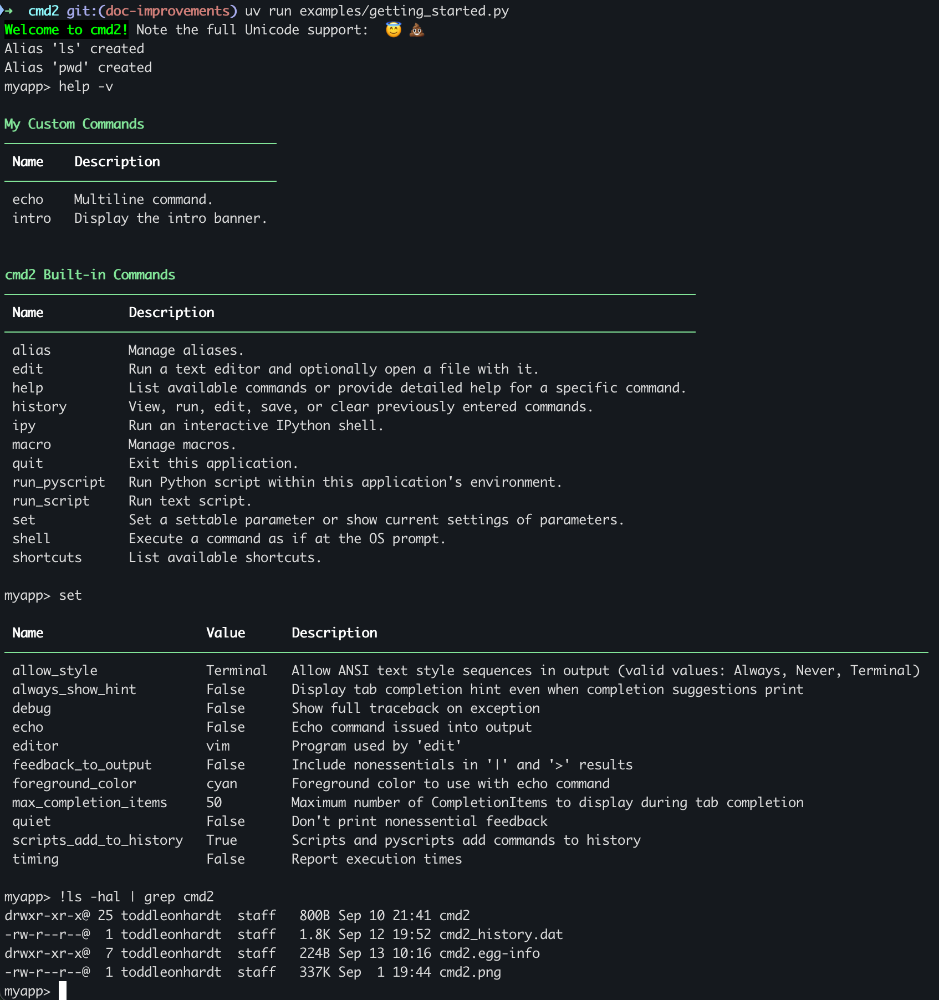

cmd2: a tool for building interactive command line apps
=======================================================
[](https://pypi.python.org/pypi/cmd2/)
[](https://travis-ci.org/python-cmd2/cmd2)
[](https://ci.appveyor.com/project/FedericoCeratto/cmd2)
[](https://codecov.io/gh/python-cmd2/cmd2)
[](http://cmd2.readthedocs.io/en/latest/?badge=latest)

cmd2 is a tool for building interactive command line applications in Python. Its goal is to make it
quick and easy for developers to build feature-rich and user-friendly interactive command line
applications.  It provides a simple API which is an extension of Python's built-in
[cmd](https://docs.python.org/3/library/cmd.html) module.  cmd2 provides a wealth of features on top
of cmd to make your life easier and eliminates much of the boilerplate code which would be necessary
when using cmd.

[](https://github.com/python-cmd2/cmd2/blob/master/cmd2.png)


Main Features
-------------
- Searchable command history (`history` command and `<Ctrl>+r`)
- Text file scripting of your application with `load` (`@`) and `_relative_load` (`@@`)
- Python scripting of your application with ``pyscript``
- Run shell commands with ``!``
- Pipe command output to shell commands with `|`
- Redirect command output to file with `>`, `>>`; input from file with `<`
- Bare `>`, `>>` with no filename send output to paste buffer (clipboard)
- `py` enters interactive Python console (opt-in `ipy` for IPython console)
- Multi-line, case-insensitive, and abbreviated commands
- Special-character command shortcuts (beyond cmd's `@` and `!`)
- Settable environment parameters
- Parsing commands with arguments using `argparse`, including support for sub-commands
- Unicode character support (*Python 3 only*)
- Good tab-completion of commands, sub-commands, file system paths, and shell commands
- Python 2.7 and 3.4+ support
- Windows, macOS, and Linux support
- Trivial to provide built-in help for all commands
- Built-in regression testing framework for your applications (transcript-based testing)
- Transcripts for use with built-in regression can be automatically generated from `history -t`

Plan for dropping Python 2.7 support
------------------------------------
Support for Python 2.7 will be discontinued on Aug 31, 2018.  After that date, new releases of `cmd2` will only support
Python 3.  Older releases of `cmd2` will of course continue to support Python 2.7.

Supporting Python 2 is an increasing burden on our limited resources.  Switching to support only Python 3 will allow
us to clean up the codebase, remove some cruft, and focus on developing new features.

Installation
------------
On all operating systems, the latest stable version of `cmd2` can be installed using pip:

```bash
pip install -U cmd2
```

cmd2 works with Python 2.7 and Python 3.4+ on Windows, macOS, and Linux. It is pure Python code with
the only 3rd-party dependencies being on [six](https://pypi.python.org/pypi/six),
[pyparsing](http://pyparsing.wikispaces.com), and [pyperclip](https://github.com/asweigart/pyperclip).
Windows has an additional dependency on [pyreadline](https://pypi.python.org/pypi/pyreadline) and Python
3.4 and earlier have an additional dependency on [contextlib2](https://pypi.python.org/pypi/contextlib2).

For information on other installation options, see
[Installation Instructions](https://cmd2.readthedocs.io/en/latest/install.html) in the cmd2
documentation.


Documentation
-------------
The latest documentation for cmd2 can be read online here: https://cmd2.readthedocs.io/en/latest/

It is available in HTML, PDF, and ePub formats.


Feature Overview
----------------
Instructions for implementing each feature follow.

- Searchable command history

    All commands will automatically be tracked in the session's history, unless the command is listed in Cmd's excludeFromHistory attribute.
    The history is accessed through the `history` command.
    If you wish to exclude some of your custom commands from the history, append their names
    to the list at `Cmd.ExcludeFromHistory`.

- Load commands from file, save to file, edit commands in file

    Type `help load`, `help history` for details.

- Multi-line commands

    Any command accepts multi-line input when its name is listed in `Cmd.multilineCommands`.
    The program will keep expecting input until a line ends with any of the characters
    in `Cmd.terminators` .  The default terminators are `;` and `/n` (empty newline).

- Case-insensitive commands

    All commands are case-insensitive, unless ``Cmd.caseInsensitive`` is set to ``False``.

- Special-character shortcut commands (beyond cmd's "@" and "!")

    To create a single-character shortcut for a command, update `Cmd.shortcuts`.

- Settable environment parameters

    To allow a user to change an environment parameter during program execution,
    append the parameter's name to `Cmd.settable``

- Parsing commands with `argparse`

    ```python
    argparser = argparse.ArgumentParser()
    argparser.add_argument('-p', '--piglatin', action='store_true', help='atinLay')
    argparser.add_argument('-s', '--shout', action='store_true', help='N00B EMULATION MODE')
    argparser.add_argument('words', nargs='+', help='words to say')
    @with_argument_parser(argparser)
    def do_speak(self, args):
        """Repeats what you tell me to."""
        words = []
        for word in args.words:
            if args.piglatin:
                word = '%s%say' % (word[1:], word[0])
            if args.shout:
                word = word.upper()
            words.append(word)
        self.stdout.write('{}\n'.format(' '.join(words)))
    ```

    See https://cmd2.readthedocs.io/en/latest/argument_processing.html for more details


Tutorials
---------

A few tutorials on using cmd2 exist:

* Florida PyCon 2017 talk: [slides](https://docs.google.com/presentation/d/1LRmpfBt3V-pYQfgQHdczf16F3hcXmhK83tl77R6IJtE)
* PyCon 2010 talk by Catherine Devlin, the original author: [video](http://pyvideo.org/pycon-us-2010/pycon-2010--easy-command-line-applications-with-c.html)
* A nice brief step-by-step tutorial: [blog](https://kushaldas.in/posts/developing-command-line-interpreters-using-python-cmd2.html)


Example Application
-------------------

Example cmd2 application (**examples/example.py**):

```python
#!/usr/bin/env python
# coding=utf-8
"""
A sample application for cmd2.
"""

import random
import argparse

from cmd2 import Cmd, with_argument_parser


class CmdLineApp(Cmd):
    """ Example cmd2 application. """

    # Setting this true makes it run a shell command if a cmd2/cmd command doesn't exist
    # default_to_shell = True
    MUMBLES = ['like', '...', 'um', 'er', 'hmmm', 'ahh']
    MUMBLE_FIRST = ['so', 'like', 'well']
    MUMBLE_LAST = ['right?']

    def __init__(self):
        self.abbrev = True
        self.multilineCommands = ['orate']
        self.maxrepeats = 3

        # Add stuff to settable and shortcuts before calling base class initializer
        self.settable['maxrepeats'] = 'max repetitions for speak command'
        self.shortcuts.update({'&': 'speak'})

        # Set use_ipython to True to enable the "ipy" command which embeds and interactive IPython shell
        Cmd.__init__(self, use_ipython=False)

    argparser = argparse.ArgumentParser()
    argparser.add_argument('-p', '--piglatin', action='store_true', help='atinLay')
    argparser.add_argument('-s', '--shout', action='store_true', help='N00B EMULATION MODE')
    argparser.add_argument('-r', '--repeat', type=int, help='output [n] times')
    argparser.add_argument('words', nargs='+', help='words to say')
    @with_argument_parser(argparser)
    def do_speak(self, args):
        """Repeats what you tell me to."""
        words = []
        for word in args.words:
            if args.piglatin:
                word = '%s%say' % (word[1:], word[0])
            if args.shout:
                word = word.upper()
            words.append(word)
        repetitions = args.repeat or 1
        for i in range(min(repetitions, self.maxrepeats)):
            # .poutput handles newlines, and accommodates output redirection too
            self.poutput(' '.join(words))

    do_say = do_speak  # now "say" is a synonym for "speak"
    do_orate = do_speak  # another synonym, but this one takes multi-line input

    argparser = argparse.ArgumentParser()
    argparser.add_argument('-r', '--repeat', type=int, help='how many times to repeat')
    argparser.add_argument('words', nargs='+', help='words to say')
    @with_argument_parser(argparser)
    def do_mumble(self, args):
        """Mumbles what you tell me to."""
        repetitions = args.repeat or 1
        for i in range(min(repetitions, self.maxrepeats)):
            output = []
            if (random.random() < .33):
                output.append(random.choice(self.MUMBLE_FIRST))
            for word in args.words:
                if (random.random() < .40):
                    output.append(random.choice(self.MUMBLES))
                output.append(word)
            if (random.random() < .25):
                output.append(random.choice(self.MUMBLE_LAST))
            self.poutput(' '.join(output))

if __name__ == '__main__':
    c = CmdLineApp()
    c.cmdloop()
```

The following is a sample session running example.py.
Thanks to Cmd2's built-in transcript testing capability, it also serves as a test
suite for example.py when saved as *transcript_regex.txt*.
Running

```bash
python example.py -t transcript_regex.txt
```
will run all the commands in the transcript against `example.py`, verifying that the output produced
matches the transcript.

example/transcript_regex.txt:

```text
# Run this transcript with "python example.py -t transcript_regex.txt"
# The regex for colors is because no color on Windows.
# The regex for editor will match whatever program you use.
# regexes on prompts just make the trailing space obvious
(Cmd) set
abbrev: True
colors: /(True|False)/
continuation_prompt: >/ /
debug: False
echo: False
editor: /.*?/
feedback_to_output: False
locals_in_py: True
maxrepeats: 3
prompt: (Cmd)/ /
quiet: False
timing: False
```

Note how a regular expression `/(True|False)/` is used for output of the **show color** command since
colored text is currently not available for cmd2 on Windows.  Regular expressions can be used anywhere within a
transcript file simply by enclosing them within forward slashes, `/`.
