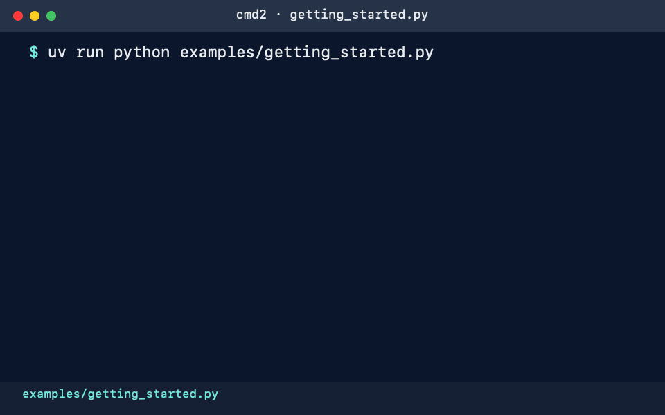

# Getting Started

Here's a quick walkthrough of the simple
[getting_started.py](https://github.com/python-cmd2/cmd2/blob/main/examples/getting_started.py)
example application which demonstrates many features of `cmd2`:

- [Settings](../features/settings.md)
- [Commands](../features/commands.md)
- [Argument Processing](../features/argument_processing.md)
- [Generating Output](../features/generating_output.md)
- [Help](../features/help.md)
- [Shortcuts](../features/shortcuts_aliases_macros.md#shortcuts)
- [History](../features/history.md)
- [Bottom Toolbar](../features/prompt.md#bottom-toolbar)

The following animation shows the `cat`, `echo`, and `intro` commands in action:



If you don't want to type as we go, here is the complete source (you can click to expand and then
click the **Copy** button in the top-right):

!!! example "getting_started.py"

    <!-- fmt:off -->
    ```py
    --8<-- "examples/getting_started.py"
    ```
    <!-- fmt:on -->

## Basic Application

The example defines `BasicApp` as a subclass of [cmd2.Cmd][]:

```py
class BasicApp(cmd2.Cmd):
    """Cmd2 application to demonstrate many common features."""
```

At the end of the file, the application creates an instance of that class and passes control to the
[cmd2.Cmd.cmdloop][] method:

```py
if __name__ == "__main__":
    app = BasicApp()
    sys.exit(app.cmdloop())
```

Run the example from the repository root:

```shell
$ uv run python examples/getting_started.py
```

The application displays its intro banner and the custom `myapp>` prompt. Because `BasicApp`
subclasses `cmd2.Cmd`, it also includes `cmd2`'s built-in commands and features. Type `quit` to
exit.

## Create a Setting

`cmd2` includes robust support for [Settings](../features/settings.md). The example stores the color
used by the `echo` command in `foreground_color`, then exposes that attribute as a runtime setting.
The choices are the color values supported by [cmd2.Color][]:

```py
# Color to output text in with echo command
self.foreground_color = Color.CYAN.value

# Make echo_fg settable at runtime
fg_colors = [c.value for c in Color]
self.add_settable(
    cmd2.Settable(
        "foreground_color",
        str,
        Text.assemble(
            "Foreground color to use with echo command ",
            "(Options: ",
            Text("Green", Style(color=Color.GREEN)),
            ", ",
            Text("Red", Style(color=Color.RED)),
            ", ",
            Text("Blue", Style(color=Color.BLUE)),
            ", ...)",
        ),
        self,
        choices=fg_colors,
    )
)
```

The [cmd2.Cmd.add_settable][] method registers a [cmd2.utils.Settable][] that validates new values
against `fg_colors`. Use the built-in `set` command to inspect or change it:

```shell
myapp> set foreground_color
myapp> set foreground_color Red
```

The first command displays the current value. The second changes the color used by subsequent `echo`
output.

## Commands

Methods whose names start with `do_` become commands. `BasicApp` defines three commands: `cat`,
`echo`, and `intro`. Each one demonstrates a different way to process arguments.

### cat

The `cat` command uses [cmd2.with_annotated][] to build its argument parser from type annotations.
The `pathlib.Path` annotation enables path completion, and [cmd2.annotated.Option][] defines the
optional `-n`/`--number` flag:

```py
@cmd2.with_annotated
def do_cat(
    self,
    path: pathlib.Path,  # Required positional argument with type annotation, tab-completes filesystem paths automatically
    numbered: Annotated[  # Optional flag argument with type annotation, default value, and help text
        bool, Option("-n", "--number", help_text="prefix each line with its number")
    ] = False,
) -> None:
    """Print a file's contents. `path` tab-completes filesystem paths automatically.

    Try:
        cat <TAB>              # path completes files/dirs -- no completer wired
        cat notes.txt
        cat notes.txt -n       # -n / --number, declared via Option metadata
        cat notes.txt --no-number
    """
    text = path.read_text()
    lines = text.splitlines()
    if numbered:
        numbered_lines = []
        for index, line in enumerate(lines, start=1):
            numbered_lines.append(f"{index}: {line}")
        self.ppaged("\n".join(numbered_lines))
    else:
        # Just print the contents using a pager
        self.ppaged(path.read_text())
```

The command uses [cmd2.Cmd.ppaged][] so longer files can be viewed in a pager. Try it on the startup
script included with the example:

```shell
myapp> cat examples/.cmd2rc --number
```

### echo

The `echo` command demonstrates [cmd2.with_argparser][]. Its parser factory defines options for
uppercasing and repeating the output, plus one or more words to print:

```py
@staticmethod
def _build_echo_parser() -> cmd2.Cmd2ArgumentParser:
    """Parser factory method for use with the echo command."""
    echo_parser = cmd2.Cmd2ArgumentParser(description="Command that echoes input.")
    echo_parser.add_argument("-u", "--upper", action="store_true", help="uppercase the output")
    echo_parser.add_argument("-r", "--repeat", type=int, default=1, help="output [n] times")
    echo_parser.add_argument("words", nargs="+", help="words to print")
    return echo_parser


@cmd2.with_argparser(_build_echo_parser)
def do_echo(self, args: argparse.Namespace) -> None:
    """Command using with_argparser decorator for parsing arguments."""
    output_str = " ".join(args.words)
    if args.upper:
        output_str = output_str.upper()

    for _ in range(args.repeat):
        self.poutput(
            stylize(
                output_str,
                style=Style(color=self.foreground_color),
            )
        )
```

The decorator parses the command line and passes an `argparse.Namespace` to `do_echo()`. It also
generates command help from the parser. The method styles the text with the configured foreground
color and writes it with [cmd2.Cmd.poutput][], which supports `cmd2` output redirection:

```shell
myapp> echo --upper --repeat 2 hello cmd2
HELLO CMD2
HELLO CMD2
myapp> help echo
```

### intro

The `intro` command takes no arguments, so it demonstrates the raw [cmd2.Statement][] interface:

```py
def do_intro(self, _: cmd2.Statement) -> None:
    """Display the intro banner.

    This command uses raw statement parsing. In general, we strongly recommend against this approach. But since this
    command effectively takes no arguments, it is safe to use raw statement parsing here.

    The & key is also used as a shortcut for this command, so you can also type & to display the intro banner.
    """
    self.poutput(self.intro)
```

Typing `intro` displays the same banner that the application shows at startup.

## Shortcuts

`cmd2` has several capabilities to simplify repetitive user input:
[Shortcuts, Aliases, and Macros](../features/shortcuts_aliases_macros.md). Let's add a shortcut to
our application. Shortcuts are character strings that can be used instead of a command name. For
example, `cmd2` has support for a shortcut `!` which runs the `shell` command. So instead of typing
this:

```shell
(Cmd) shell ls -al
```

you can type this:

```shell
(Cmd) !ls -al
```

The example adds `&` as a shortcut for the `intro` command:

```py
shortcuts = cmd2.DEFAULT_SHORTCUTS
shortcuts.update({"&": "intro"})
```

The `shortcuts` dictionary is then passed to the `cmd2.Cmd` initializer with the rest of the
application configuration. Starting with [cmd2.DEFAULT_SHORTCUTS][] retains the built-in shortcuts;
calling `.update()` adds the new shortcut or overrides an existing one with the same key.

Use the built-in `shortcuts` command to list them, or type `&` to invoke `intro`:

```shell
myapp> shortcuts
myapp> &
```

## History

`cmd2` tracks the history of the commands that users enter. As a developer, you don't need to do
anything to enable this functionality, you get it for free. If you want the history of commands to
persist between invocations of your application, you'll need to do a little work. The
[History](../features/history.md) page has all the details.

Users can access command history using two methods:

- The [prompt-toolkit](https://github.com/prompt-toolkit/python-prompt-toolkit) library which
  provides a pure Python replacement for the
  [GNU readline library](https://en.wikipedia.org/wiki/GNU_Readline) which is fully cross-platform
  compatible
- The `history` command which is built-in to `cmd2`

From the prompt in a `cmd2`-based application, you can press `Control-p` to move to the previously
entered command, and `Control-n` to move to the next command. You can also search through the
command history using `Control-r`.

By default, `prompt-toolkit` provides Emacs-style key bindings which will be familiar to users of
the GNU Readline library. You can refer to the
[readline cheat sheet](http://readline.kablamo.org/emacs.html) or you can dig into the
[Prompt Toolkit User Manual](https://python-prompt-toolkit.readthedocs.io/en/stable/pages/advanced_topics/key_bindings.html)
for all the details, including instructions for customizing the key bindings.

The `history` command allows a user to view the command history, and select commands from history by
number, range, string search, or regular expression. With the selected commands, users can:

- Re-run the commands
- Edit the selected commands in a text editor, and run them after the text editor exits
- Save the commands to a file
- Run the commands, saving both the commands and their output to a file

Learn more about the `history` command by typing `history -h` at any `cmd2` input prompt, or by
exploring [Command History For Users](../features/history.md#for-users).

## Conclusion

You've just created a simple, but functional command line application. With minimal work on your
part, the application leverages many robust features of `cmd2`. To learn more you can:

- Dive into all of the [Features](../features/index.md) that `cmd2` provides
- Look at more [Examples](../examples/index.md)
- Browse the [API Reference](../api/index.md)
