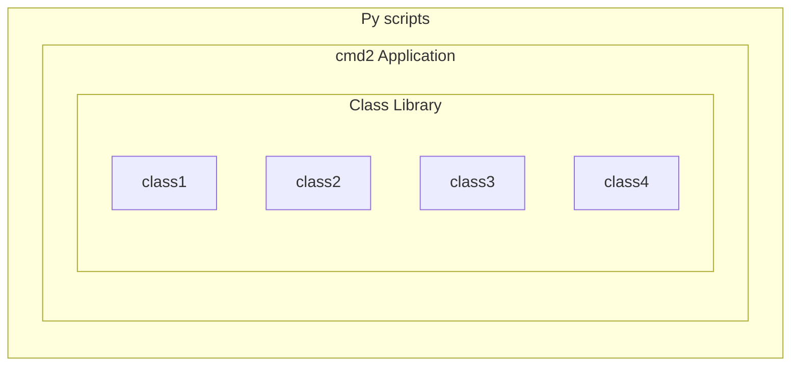

# Scripting

Operating system shells have long been able to execute a sequence of commands saved in a text file.
These script files simplify the repeated execution of long command sequences. `cmd2` supports two
similar mechanisms: command scripts and python scripts.

## Command Scripts

A command script contains a sequence of commands typed at the prompt of a `cmd2` based application.
Unlike operating system shell scripts, command scripts can't contain logic or loops.

### Creating Command Scripts

Command scripts can be created in several ways:

- creating a text file using any method of your choice
- using the built-in [edit](./builtin_commands.md#edit) command to create or edit an existing text
  file
- saving previously entered commands to a script file using [history -s](./history.md#for-users)

If you create a text file from scratch, just include one command per line, exactly as you would type
it inside a `cmd2` application.

### Running Command Scripts

Command script files can be executed using the built-in
[run_script](./builtin_commands.md#run_script) command or the `@` shortcut (if your application is
using the default shortcuts). Both ASCII and UTF-8 encoded Unicode text files are supported. The
[run_script](./builtin_commands.md#run_script) command supports tab completion of file system paths.
There is a variant [\_relative_run_script](./builtin_commands.md#_relative_run_script) command or
`@@` shortcut (if using the default shortcuts) for use within a script which uses paths relative to
the first script.

### Comments

A command line is a comment if the first non-whitespace character is a `#`. This means any `#`
character appearing later in the command will be treated as a literal. The same applies to a `#` in
the middle of a multiline command, even if it is the first character on a line.

Comments are useful in scripts, but are generally not used within an interactive session.

    (Cmd) # this is a comment
    (Cmd) command # this is not a comment

## Python Scripts

If you require logic flow, loops, branching, or other advanced features, you can write a python
script which executes in the context of your `cmd2` app. This script is run using the
[run_pyscript](./builtin_commands.md#run_pyscript) command. Here's a simple example that uses the
[arg_printer.py](https://github.com/python-cmd2/cmd2/blob/main/examples/scripts/arg_printer.py)
pyscript:

    (Cmd) run_pyscript examples/scripts/arg_printer.py foo bar 'baz 23'
    Running Python script 'arg_printer.py' which was called with 3 arguments
    arg 1: 'foo'
    arg 2: 'bar'
    arg 3: 'baz 23'

[run_pyscript](./builtin_commands.md#run_pyscript) supports tab completion of file system paths, and
as shown above it has the ability to pass command-line arguments to the scripts invoked.

## Developing a cmd2 API

If you as an app designer have not explicitly disabled the `run_pyscript` command, you should assume
your application will be used for higher-level Python scripting. The following sections are meant as
guidelines and highlight possible pitfalls with both production and consumption of API
functionality. For clarity, a "scripter" writes pyscripts, and a "designer" is the `cmd2`
application author.

### Basics

Without any work on the part of the designer, a scripter can take advantage of piecing together
workflows using simple `app` calls. The result of a `run_pyscript` app call yields a
[CommandResult][cmd2.CommandResult] object exposing four members: `stdout`, `stderr`, `stop`, and
`data`.

`stdout` and `stderr` are fairly straightforward representations of normal data streams and
accurately reflect what the user sees during normal cmd2 interaction. `stop` contains information
about how the invoked command has ended its lifecycle. Lastly `data` contains any information the
designer sets via `self.last_result` or `self._cmd.last_result` if called from inside a CommandSet.

Python scripts executed with [run_pyscript](./builtin_commands.md#run_pyscript) can run `cmd2`
application commands by using the syntax:

```py
app(‘command args’)
```

where:

- `app` is a configurable name which can be changed by setting the `cmd2.Cmd.py_bridge_name`
  attribute
- `command` and `args` are entered exactly like they would be entered by a user of your application.

Using f-strings tends to be the most straightforward and easily readable way to provide parameters.:

```py
first = 'first'
second = 'second'

app(f'command {first} -t {second})
```

See
[python_scripting.py](https://github.com/python-cmd2/cmd2/blob/main/examples/python_scripting.py)
example and associated
[conditional.py](https://github.com/python-cmd2/cmd2/blob/main/examples/scripts/conditional.py)
script for more information.

### Design principles

If your cmd2 application follows the
[Unix design philosophy](https://en.wikipedia.org/wiki/Unix_philosophy) a scripter will have the
most flexibility to create workflows using different commands. If the designer's application is more
complete and less likely to be augmented in the future, a scripter can use simple serial scripts
with little control flow. In either case, choices made by the designer will have effects on
scripters.

The following diagram illustrates the different boundaries to keep in mind.



!!! note

    As a designer, you should design from the inside out. Your code will be much easier to unit test than at the higher level. While there are regression testing extensions for cmd2, unit testing will always be faster for development.

!!! warning

    It is bad design for a high-level pyscript to know about, let alone access, low-level class libraries of an application. Resist this urge as much as possible, unless it's necessary.

### Developing a Basic API

By default, `cmd2` allows scripters to take advantage of all exposed `do_*` commands. As a scripter,
you can easily interact with the application via `stdout` and `stderr`.

As a baseline, let's start with the following `cmd2` application called `FirstApp`

```py
#!/usr/bin/env python
"""A simple cmd2 application."""
import cmd2


class FirstApp(cmd2.Cmd):
    """A simple cmd2 application."""
    def __init__(self):
        shortcuts = cmd2.DEFAULT_SHORTCUTS
        shortcuts.update({'&': 'speak'})
        super().__init__(shortcuts=shortcuts)

        # Make maxrepeats settable at runtime
        self.maxrepeats = 3
        self.add_settable(cmd2.Settable('maxrepeats', int, 'max repetitions for speak command', self))


    speak_parser = cmd2.Cmd2ArgumentParser()
    speak_parser.add_argument('-p', '--piglatin', action='store_true', help='atinLay')
    speak_parser.add_argument('-s', '--shout', action='store_true', help='N00B EMULATION MODE')
    speak_parser.add_argument('-r', '--repeat', type=int, help='output [n] times')
    speak_parser.add_argument('words', nargs='+', help='words to say')

    @cmd2.with_argparser(speak_parser)
    def do_speak(self, args):
        """Repeats what you tell me to."""
        words = []
        for word in args.words:
            if args.piglatin:
                word = '%s%say' % (word[1:], word[0])
            if args.shout:
                word = word.upper()
            words.append(word)
        repetitions = args.repeat or 1
        for _ in range(min(repetitions, self.maxrepeats)):
            # .poutput handles newlines, and accommodates output redirection too
            self.poutput(' '.join(words))

if __name__ == '__main__':
    import sys
    c = FirstApp()
    sys.exit(c.cmdloop())
```

Let's start with an example of what not to do:

```py
app('speak'
print('Working')

SyntaxError: unexpected EOF while parsing
(Cmd) run_pyscript script.py
    File "<string>", line 2
    app('speak'
                ^
SyntaxError: unexpected EOF while parsing
```

`cmd2` pyscripts require **valid** Python code as a first step.

!!! warning

    It is a common misconception that all application exceptions will propagate up from below. This is not the case. `cmd2` catches all application exceptions and there are no means to handle them.

When executing the `speak` command without parameters you see the following error:

    (Cmd) speak
    Usage: speak [-h] [-p] [-s] [-r REPEAT] words [...]
    Error: the following arguments are required: words

Even though this is a fully qualified `cmd2` error, the pyscript must check for this error and
perform error checking.:

```py
app('speak')
print("Working")
```

    (Cmd) run_pyscript script.py
    Working
    (Cmd)

You should notice that no error message is printed. Let's utilize the `CommandResult` object to
inspect the actual returned data.:

```py
result = app('speak')
print(result)
```

    (Cmd) run_pyscript script.py
    CommandResult(stdout='', stderr='Usage: speak [-h] [-p] [-s] [-r REPEAT] words [...]\nError: the following arguments are required: words\n\n', stop=False, data=None)

Now we can see that there has been an error. Let's rewrite the script to perform error checking.:

```py
result = app('speak')

if not result:
    print(result.stderr)
```

    (Cmd) run_pyscript script.py
    Something went wrong

In Python development, it is good practice to fail fast after user input.:

```py
import sys

result = app('speak TRUTH!!')

if not result:
    print("Something went wrong")
    sys.exit()

print("Continuing along..")
```

    (Cmd) run_pyscript script.py
    Continuing along..

We changed the input to be a valid `speak` command, but there was no output. Again we must inspect
the `CommandResult`:

```py
import sys

#Syntax error
result = app('speak TRUTH!!!')
if not result:
    print("Something went wrong")
    sys.exit()

print(result.stdout)
```

    (Cmd) run_pyscript script.py
    TRUTH!!!

By just using `stdout` and `stderr` it is possible to chain commands with rudimentary control flow.
In the next section we will show how to use `cmd_result` data.

### Developing an Advanced API

So far, we haven't focused on the scripter's needs. Wouldn't it be nice if while creating pyscripts
you did not have to parse data from `stdout`? We can accommodate the scripter by adding one small
line at the end of our `do_*` commands.

`self.last_result = <value>`

Adding the above line enhances a cmd2 application and opens a new world of possibilities.

!!! tip

    When setting results for a command function inside of a CommandSet use the private cmd instance:

    ```py
    self._cmd.last_result = <value>
    ```

In the following command example we return a list containing directory elements.:

```py
dir_parser = cmd2.Cmd2ArgumentParser()
dir_parser.add_argument('-l', '--long', action='store_true',
                        help="display in long format with one item per line")

@cmd2.with_argparser(dir_parser, with_unknown_args=True)
def do_dir(self, args, unknown):
    """List contents of current directory."""
    # No arguments for this command
    if unknown:
        self.perror("dir does not take any positional arguments:")
        self.do_help('dir')
        return

    # Get the contents as a list
    contents = os.listdir(self.cwd)

    for f in contents:
        self.poutput(f'{f}')
    self.poutput('')

    self.last_result = contents
```

The following script retrieves the array contents.:

```py
result = app('dir')
print(result.data)
```

Results:

    Cmd) run_pyscript script.py
    ['.venv', 'app.py', 'script.py']

As a rule of thumb, designers should return simple scalar types as command results instead of
complex objects. If it is beneficial in providing class objects designers should choose immutable
over mutable types and never provide direct access to class members as this could potentially lead
to violation of the
[open-closed_principle](https://en.wikipedia.org/wiki/Open%E2%80%93closed_principle).

When possible, a frozen dataclass is a lightweight solution ideal for data manipulation. Let's look
at an example.

The following application has two commands: `build` and `status`. Let's assume that the build action
happens somewhere else in the world at a REST API endpoint and has significant computational cost.
The status command, will only show the current status of a build task. The application has provided
everything that is needed for a user to start a build and then determine its status. However, the
problem is that with a long running process the user may want to wait for it to finish. A designer
may be tempted to create a command to start a build and then poll for status until finished, but
this scenario is better solved as a script.

app.py:

```py
#!/usr/bin/env python
"""A simple cmd2 application."""
import sys
from dataclasses import dataclass
from random import choice, randint
from typing import Optional

import cmd2
from cmd2.parsing import Statement


@dataclass(frozen=True)
class BuildStatus:
    id: int
    name: str
    status: str


class FirstApp(cmd2.Cmd):
    """A simple cmd2 application."""

    def __init__(self):
        self._status_cache = dict()

    def _start_build(self, name: str) -> BuildStatus:
        return BuildStatus(randint(10, 100), name, "Started")

    def _get_status(self, name: str) -> Optional[BuildStatus]:

        status = self._status_cache.get(name)

        status_types = ["canceled", "restarted", "error", "finished"]

        if status.status != "finished":
            status = BuildStatus(status.id, status.name, choice(status_types))
            self._status_cache[name] = status

        return status

    build_parser = cmd2.Cmd2ArgumentParser()
    build_parser.add_argument("name", help="Name of build to start")

    @cmd2.with_argparser(build_parser)
    def do_build(self, args: Statement):
        """Executes a long running process at an API endpoint"""
        status = self._start_build(args.name)
        self._status_cache[args.name] = status

        self.poutput(
            f"Build {args.name.upper()} successfully started with id : {status.id}"
        )
        self.last_result = status

    status_parser = cmd2.Cmd2ArgumentParser()
    status_parser.add_argument("name", help="Name of build determine status of")

    @cmd2.with_argparser(status_parser)
    def do_status(self, args: Statement):
        """Shows the current status of a build"""

        status = self._get_status(args.name)

        self.poutput(f"Status for Build: {args.name} \n {status.status}")
        self.last_result = status


if __name__ == "__main__":
    import sys

    c = FirstApp()
    sys.exit(c.cmdloop())
```

Below is a possible solution via pyscript:

```py
import sys
import time

# start build
result = app('build tower')

# If there was an error then exit
if not result:
    print('Build failed')
    sys.exit()

# This is a BuildStatus dataclass object
build = result.data

print(f"Build {build.name} : {build.status}")

# Poll status
while True:

    # Perform status check
    result = app('status tower')

    #error checking
    if not result:
        print("Unable to determine status")
        break

    build_status = result.data

    # If the status shows complete then the script is done
    if build_status.status in ['finished', 'canceled']:
        print(f"Build {build.name} has completed")
        break

    print(f"Current Status: {build_status.status}")
    time.sleep(1)
```
