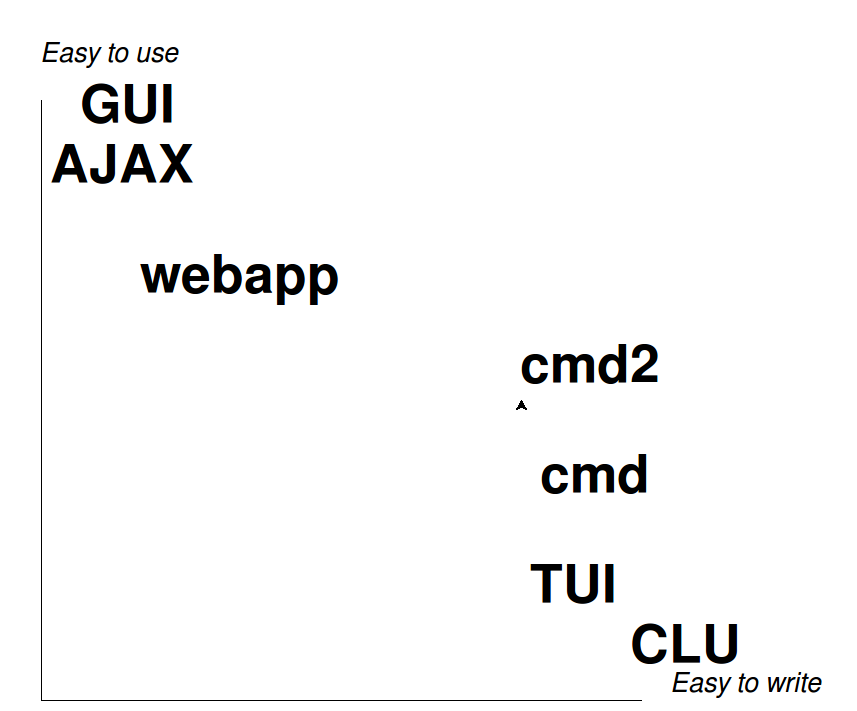

=====
Title
=====

Web 2.0
=======

.. image:: web-2-0-logos.gif
   :height: 300px
   
But first...
============

.. image:: sargon.jpg
   :height: 300px

Sargon the Great
  Founder of Akkadian Empire
  
.. twenty-third century BC

In between
==========

.. image:: apple.jpg
   :height: 300px
 
Command-Line Interface
  Unlike the Akkadian Empire, 
  the CLI will never die.

Defining
========
  
- "Line-oriented command interpreter"
- "Command-line interface"
- "Shell"

1. Accepts free text input at prompt
2. Outputs lines of text
3. (repeat)

Examples
========

* Bash, Korn, zsh
* Python shell
* screen
* Zork
* SQL clients: psql, SQL*\Plus, mysql...
* ed

.. ``ed`` proves that CLI is sometimes the wrong answer.

!= Command Line Utilities
=========================

1. Accepts arguments at invocation
2. executes
3. terminates

Examples
--------
* ls
* grep
* ping

Use ``sys.argv``, ``optparse``

!= "Text User Interfaces", "Consoles"
=====================================

* Use entire (session) screen
* I/O is *not* line-by-line

.. image:: urwid.png
   :height: 300px
   
Use ``curses``, ``urwid``

Tradeoff
========

   
pirate.py
=========

::

   from cmd import Cmd
   
   class Pirate(Cmd):
       pass
   
   pirate = Pirate()
   pirate.cmdloop()

Nothing here... but history and help

.. ctrl-r for bash-style history

Fundamental prrrinciple
=======================

.. class: huge

   ``foo a b c`` ->
   
   ``self.do_foo('a b c')``

``do_``-methods: pirate2.py
===========================

::

   class Pirate(Cmd):
       gold = 10
       def do_loot(self, arg):
           'Seize booty frrrom a passing ship.'
           self.gold += 1
           print('Now we gots {0} doubloons'.format(self.gold))
       def do_drink(self, arg):
           'Drown your sorrrows in rrrum.'
           self.gold -= 1
           print('Now we gots {0} doubloons'.format(self.gold))

.. do_methods; more help           

Hooks
=====

.. image:: hook.jpeg
   :height: 300px

Hooks: pirate3.py
=================

::

   class Pirate(Cmd):
       gold = 3
       def do_loot(self, arg):
           'Drown your sorrrows in rrrum.'        
           self.gold += 1
       def do_drink(self, arg):
           'Drown your sorrrows in rrrum.'        
           self.gold -= 1
       def postcmd(self, stop, line):                         
           print('Now we gots {0} doubloons'.format(self.gold))
           
Arguments: pirate4.py
=====================

::

        def do_drink(self, arg):
            '''Drown your sorrrows in rrrum.
            
            drink [n] - drink [n] barrel[s] o' rum.'''  
            try:
                self.gold -= int(arg)
            except:
                if arg:
                    print('''What's "{0}"?  I'll take rrrum.'''
                          .format(arg))
                self.gold -= 1            
        
quitting: pirate5.py
====================

::

    def postcmd(self, stop, line):
        print('Now we gots {0} doubloons'
              .format(self.gold))
        if self.gold < 0:
            print("Off to debtorrr's prrrison.  Game overrr.")
            return True
        return stop
    def do_quit(self, arg):
        print("Quiterrr!")
        return True   

prompts and defaults: pirate6.py
================================

::

    prompt = 'arrr> '
    def default(self, line):
        print('What mean ye by "{0}"?'
              .format(line))
        
cmd2
====

Third-party module in PyPI

What you get
============

    * Script files
    * Commands at invocation
    * Output redirection    
    * Python
    * Transcript-based testing
    
    * Searchable command history
    * Quitting the application
    * Comments
    * Misc. pre-defined commands
    
More
====

    * Case-insensitivity
    * Shortcuts
    * Default to shell
    * Timing
    * Echo
    * Debug
    * Other user-settable parameters
