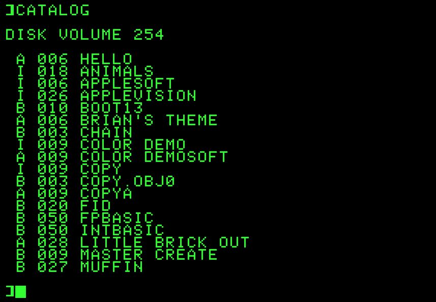
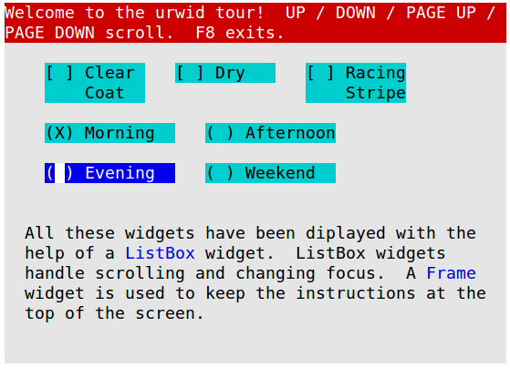
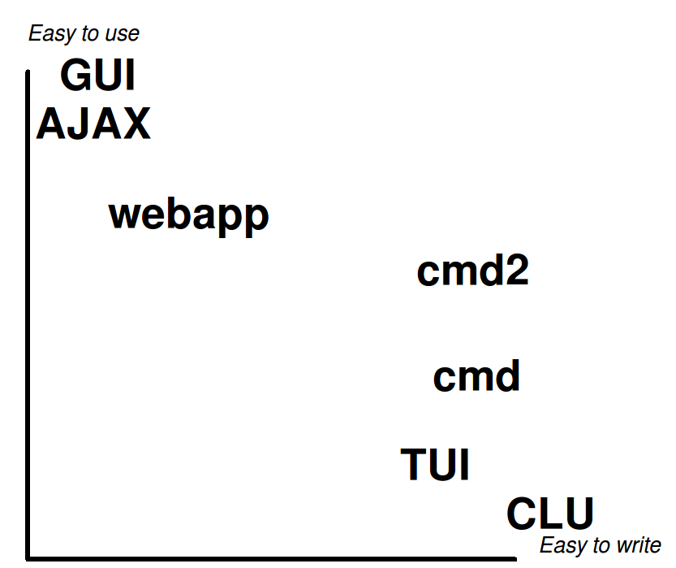

================================================
Easy command-line interpreters with cmd and cmd2
================================================

:author:  Catherine Devlin
:date:    2010-02-20
:slides:  http://pypi.python.org/pypi/cmd2

Web 2.0
=======

But first...
============

Sargon the Great
  Founder of Akkadian Empire

.. twenty-third century BC

In between
==========

Command-Line Interface
  Unlike the Akkadian Empire,
  the CLI will never die.

Defining CLI
============

Also known as

- "Line-oriented command interpreter"
- "Command-line interface"
- "Shell"

1. Accepts free text input at prompt
2. Outputs lines of text
3. (repeat)

Examples
========

.. class:: big

   * Bash, Korn, zsh
   * Python shell
   * screen
   * Zork
   * SQL clients: psql, SQL*\Plus, mysql...
   * ed

.. ``ed`` proves that CLI is sometimes the wrong answer.

!= Command Line Utilities
=========================

.. class:: big

   (``ls``, ``grep``, ``ping``, etc.)

   1. Accept arguments at invocation
   2. execute
   3. terminate

   Use ``sys.argv``, ``optparse``

!="Text User Interface"
=======================

* Use entire (session) screen
* I/O is *not* line-by-line
* See ``curses``, ``urwid``

Decide your priorities
======================

A ``cmd`` app: pirate.py
========================

::

   from cmd import Cmd

   class Pirate(Cmd):
       pass

   pirate = Pirate()
   pirate.cmdloop()

.. Nothing here... but history and help

.. ctrl-r for bash-style history

Fundamental prrrinciple
=======================

.. class:: huge

   ``(Cmd) foo a b c``

   becomes

   ``self.do_foo('a b c')``

``do_``-methods: pirate2.py
===========================

::

   class Pirate(Cmd):
       gold = 3
       def do_loot(self, arg):
           'Seize booty frrrom a passing ship.'
           self.gold += 1
           print('Now we gots {0} doubloons'
                 .format(self.gold))
       def do_drink(self, arg):
           'Drown your sorrrows in rrrum.'
           self.gold -= 1
           print('Now we gots {0} doubloons'
                 .format(self.gold))

.. do_methods; more help

Hooks
=====

::

   self.preloop()
   self.postloop()
   self.precmd(line)
   self.postcmd(stop, line)

Hooks: pirate3.py
=================

::

    def do_loot(self, arg):
        'Seize booty from a passing ship.'
        self.gold += 1
    def do_drink(self, arg):
        'Drown your sorrrows in rrrum.'
        self.gold -= 1
    def precmd(self, line):
        self.initial_gold = self.gold
        return line
    def postcmd(self, stop, line):
        if self.gold != self.initial_gold:
            print('Now we gots {0} doubloons'
                  .format(self.gold))

Arguments: pirate4.py
=====================

::

        def do_drink(self, arg):
            '''Drown your sorrrows in rrrum.

            drink [n] - drink [n] barrel[s] o' rum.'''
            try:
                self.gold -= int(arg)
            except:
                if arg:
                    print('''What's "{0}"?  I'll take rrrum.'''
                          .format(arg))
                self.gold -= 1

quitting: pirate5.py
====================

::

    def postcmd(self, stop, line):
        if self.gold != self.initial_gold:
            print('Now we gots {0} doubloons'
                  .format(self.gold))
        if self.gold < 0:
            print("Off to debtorrr's prison.")
            stop = True
        return stop
    def do_quit(self, arg):
        print("Quiterrr!")
        return True

prompts, defaults: pirate6.py
=============================

::

    prompt = 'arrr> '
    def default(self, line):
        print('What mean ye by "{0}"?'
              .format(line))

Other CLI packages
==================

.. class:: big

   * CmdLoop
   * cly
   * CMdO
   * pycopia
   * cmdlin
   * cmd2

Demo
====

.. class:: huge

   Convert ``cmd`` app to ``cmd2``

cmd2
====

As you wish, Guido
==================

.. class:: huge

   Python 3 compatible

(um, mostly)

Absolutely free
===============

Script files

Commands at invocation

Output redirection

Python

Transcript testing

But wait, there's more
======================

    * Abbreviated commands
    * Shell commands
    * Quitting
    * Timing
    * Echo
    * Debug

Minor changes: pirate7.py
=========================

::

    default_to_shell = True
    multilineCommands = ['sing']
    terminators = Cmd.terminators + ['...']
    songcolor = 'blue'
    settable = Cmd.settable + 'songcolor Color to ``sing`` in (red/blue/green/cyan/magenta, bold, underline)'
    Cmd.shortcuts.update({'~': 'sing'})
    def do_sing(self, arg):
        print(self.colorize(arg, self.songcolor))

Now how much would you pay?
===========================

options / flags

Quiet (suppress feedback)

BASH-style ``select``

Parsing: terminators, suffixes

Options: pirate8.py
===================

::

    @options([make_option('--ho', type='int', default=2,
                          help="How often to chant 'ho'"),
              make_option('-c', '--commas',
                          action="store_true",
                          help="Intersperse commas")])
    def do_yo(self, arg, opts):
        chant = ['yo'] + ['ho'] * opts.ho
        separator = ', ' if opts.commas else ' '
        chant = separator.join(chant)
            print('{0} and a bottle of {1}'
                      .format(chant, arg))

Serious example: sqlpython
==========================

.. class:: big

   ``cmd``-based app by Luca Canali @ CERN

   Replacement for Oracle SQL\*Plus

   Now ``cmd2``-based; postgreSQL; MySQL

File reporter
=============

.. class:: huge

   Gather info: Python

   Store: postgresql

   Report: html

fileutil.py
===========

::

    import glob
    import os.path

    for fullfilename in glob.glob('/home/cat/proj/cmd2/*.py'):
        (dirpath, fname) = os.path.split(fullfilename)
        stats = os.stat(fullfilename)
        binds['path'] = dirpath
        binds['name'] = fname
        binds['bytes'] = stats.st_size
        cmd("""INSERT INTO cat.files (path, name, bytes)
               VALUES (%(path)s, %(name)s, %(bytes)s)""")
    quit()

sqlpython features
==================

.. class:: big

   * from ``cmd2``: scripts, redirection,
     py, etc.
   * multiple connections
   * UNIX: ls, cat, grep
   * Special output

Thank you
=========

.. class:: big

    http://pypi.python.org/pypi/cmd2

    http://catherinedevlin.blogspot.com

    http://catherinedevlin.pythoneers.com

